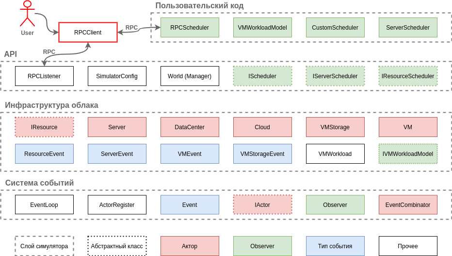

# The Cloud Simulator

## Build

1) Clone submodules: `git submodule init --update` from repo root;
2) Generate Makefiles: `cmake PATH_TO_REPO_ROOT` from build directory;
3) Build simulator engine: `make simulator`;
4) Build console client: `make client`.

## Usage

1) Specify configuration of the cloud ([sample](/config))
2) The simulator engine binary is located in `src/simulator` folder. Run
   simulator with 3 required arguments:
   * `--config path/to/config/directory`
   * `--logs-folder path/to/folder/for/logs`
   * `--port <port-which-engine-should-listen>`
3) The client binary is located in `src/client` folder. It should be runned with
   arguments `--host <engine-host> --port <engine-port>`.
4) Log is printed to the engine's stdout, duplicated to `.csv`-file in the
   specified directory and sent to the client.
5) Available console commands:
   * `boot`/`shutdown` `RESOURCE_NAME`;
   * `create-vm`/`provision-vm`/`stop-vm`/`delete-vm` `VM_NAME`.

Notes:

* By default the whole Cloud has name `cloud-1`, so it can be booted
  by `boot cloud-1` CLI command
* Data centers are named as in the `cloud.yaml` spec
* Servers are named as `SERVER_NAME-SERVER_SERIAL`, where `SERVER_NAME` is
  the `name` value specified in `specs.yaml`

## Dependencies

* [yaml-cpp](https://github.com/jbeder/yaml-cpp) for parsing YAML files
* [argparse](https://github.com/p-ranav/argparse) for parsing command-line
  arguments
* [fmtlib](https://github.com/fmtlib/fmt.git) for convenient string formatting
* [replxx](https://github.com/AmokHuginnsson/replxx.git) for CLI
* [NamedType](https://github.com/joboccara/NamedType.git) for convenient strong
  typedef
* [gRPC](https://github.com/grpc/grpc.git) for RPC communication

Dependencies are attached to the project using git submodules, to do not forget
to load them before compiling.

## Architecture

The simulator has a layered design, as most of the analogues do. Everything is
based on a discrete-time event loop, which gives ability of creating and
receiving events using special API.

On the top of the event loop there are representations of the infrastructure (
physical entities and virtual machines), management classes and API of the
simulator.

## Thesis

Only Russian, available [here](texts/diploma-final.pdf).

## Work plan for the nearest future

Look to the `Github Projects` tab.

## Used links

1) [Writing a Discrete Event Simulation: ten easy lessons](https://users.cs.northwestern.edu/~agupta/_projects/networking/QueueSimulation/mm1.html)

2) [DISSECT-CF: a simulator to foster energy-aware scheduling in infrastructure clouds](https://arxiv.org/pdf/1604.06581.pdf):
   strongly influenced by this paper
